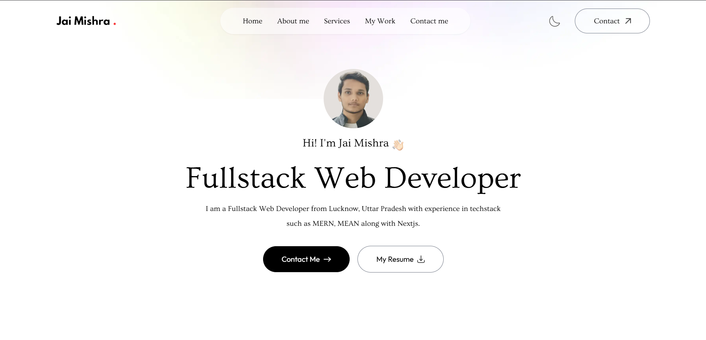
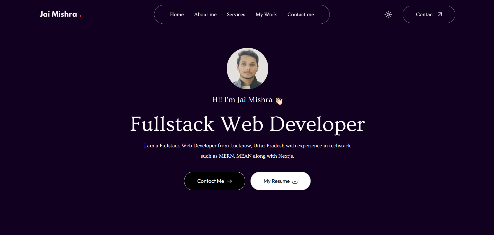

# Jai Mishra - Portfolio Website

A modern and responsive portfolio website built to showcase my skills, services, and projects as a Fullstack Web Developer.

## 🌐 Live Preview

### 🌞 Light Mode

### 🌙 Dark Mode

---

## 🧑‍💻 About Me

Hi! I'm **Jai Mishra**, a Fullstack Web Developer from **Lucknow, Uttar Pradesh** with experience in building scalable, responsive, and interactive applications using the **MERN**, **MEAN**, and **Next.js** stacks.

### 📌 Quick Intro
- 🎓 B.Tech in Computer Science, Indian Institute of Information Technology Bhagalpur
- 💼 Former Intern @ Infosys, built a real-time auction bidding platform using the MEAN stack
- 🚀 Built 10+ personal and freelance projects
- 📚 Passionate about learning, building, and solving real-world problems through code

---

## 💼 Sections

### 🏠 Home
A clean, hero section with intro, resume link, and contact CTA.

### 👤 About Me
More about my background, skills, tools I use, and technical stack.

### 🛠️ Services
- **Frontend Development:** Responsive and aesthetic UIs using React, Angular
- **Backend Development:** Robust server-side logic using Node.js, Express
- **UI/UX Design:** Seamless and user-centric experiences
- **Mobile App Development:** Cross-platform apps with modern tools

### 💻 My Work
Featured projects:
- **Auction Platform** – Full Stack
- **Code Editor** – Full Stack
- **FinancePro** – Personal Finance Platform
- **Portfolio** – Frontend Project

### 📞 Contact Me
Built-in form with name, email, message, and submit button. Also includes email address and social media links.

---

## 🧰 Tech Stack & Tools

**Languages & Frameworks:**
- C/C++, Python, HTML, CSS, JavaScript
- React, Angular, Node.js, Express.js, Next.js

**Tools I Use:**
- VS Code, GitHub, Figma, Postman, MongoDB, MySQL, Tailwind CSS

---

## 📫 Contact

- 📧 jaimishra502@gmail.com  
- 🌐 [GitHub](https://github.com/JaiMishra25)  
- 🔗 [LinkedIn](https://linkedin.com/in/JaiMishra25)

---

© 2025 Jai Mishra. All rights reserved.
